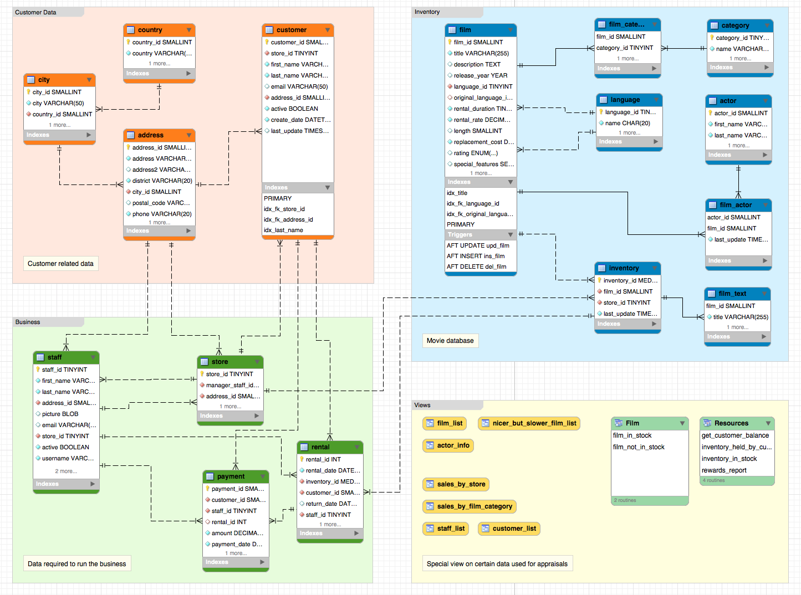

# Pratique de manipulation de données

### Exercice:

1. Imprimer le nom et le montant de la facture totale des personnes habitant la ville de Lubumbashi
2. Imprimer le nom et le montant de factures des personnes habitant le Congo et l'algerie (ANSI-92)
3. Imprimer le nom et le montant de la facture totale des personnes habitant le Congo et l'Algerie (ANSI-92)

* Correction
Se référer au fichier suivant:

[JOIN](JOIN.md)


### Example de bases de données
http://dev.mysql.com/doc/index-other.html

### Fichier sakila-db
. Télécharger le fichier world.sql dans le répertoire racine du projet.

http://downloads.mysql.com/docs/sakila-db.zip

. Décompresser le fichier

### Charger les données dans Docker 

- remplacer le <PWD>

- Créer la base de données sakila

```
$ docker exec -it some-mysql mysql -u root -p -e "create database sakila;"
```

- Créer l'utilisateur etudiants

```
$ docker exec -it some-mysql \
 mysql -u root -p -e "GRANT ALL PRIVILEGES on *.* TO 'etudiants'@'localhost' IDENTIFIED BY 'etudiants_1' WITH GRANT OPTION;"
```

- Charger la base

```
$ docker exec  -i some-mysql  mysql -u etudiants -p<MDP> sakila < ~/sakila-db/sakila-schema.sql
```

- Charger les données

```
$ docker exec  -i some-mysql  mysql -u etudiants -p<MDP> sakila < ~/sakila-db/sakila-data.sql
```

### Entity Repation Diagram


